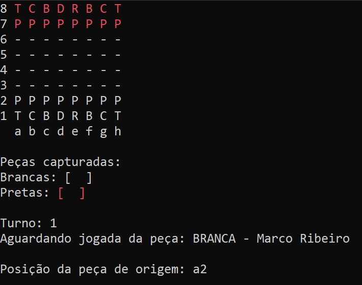

<h1 align="center" id ="sobre">Xadrez - SharpCoders &#9813:magnet: 
 </h1>
Jogo desenvolvido para ser jogado com dois jogadores. É necessário cadastro e efetuar login para jogar. Projeto desenvolvido para o programa de formação SharpCoders.

Nesse programa você jogará xadrez com as mesmas regras do xadrez internacional. Estão implementadas todas as jogadas especiais. 

 <a href="#sobre">Sobre</a> •
 <a href="#demonstracao">Demonstração</a> • 
 <a href="#features">Features</a> • 
 <a href="#tecnologias">Tecnologias</a> • 
 <a href="#autor">Autor</a>

<h2 align="center" id="demonstracao"> Demonstração de início da partida </h2>

<h1 align="center">
  
  
  
  
</h1>
<ul>
  <li>O primeiro jogador a logar, recebe a peça branca. O segundo, a preta.</li>
  <li>Cada peça capturada entra no conjunto de pecas capturadas, abaixo do tabuleiro. Em sua respectiva cor.</li>
  <li>Toda peça do tabuleiro quando é selecionada mostra ao jogador todos os seus movimentos possíveis.</li>
  <li>Temos as jogadas especias como: En passant, roque pequeno, roque grande e promoção. Na jogada promoção, o seu peão vira a rainha diretamente.</li>
  <li>Na partida só existe vitória por xeque-mate. O jogador logado vitorioso, ganha um ponto. E nada acontece com o outro.</li>
  <li>Quando a vitória é registrada, o programa é finalizado.</li>
</ul>

<h1 align="center" id="features">Features :hammer_and_wrench:</h1>

Quando abrir a aplicação você terá o menu inicial. 

Nesse menu você poderá escolher entre 3 opções: 

<ol>
  <li>Logar as contas, caso já tenham sido cadastradas.</li>
    <dd> - É necessário ter duas contas criadas para conseguir acessar a partida. </dd>
    <dd> - Após o login, vocês serão redirecionados direto ao tabuleiro de xadrez. </dd>
  <li>Cadastrar novas contas.</li>
    <dd> - Você cadastra um login, uma senha e usa o seu nome para ser identificado. </dd>
    <dd> - Você volta ao menu inicial após o cadastro. </dd>
  <li>Ver o nome de jogadores cadastrados.</li>
    <dd> - Mostra o nome de todos os usuários cadastrados e o número de vitórias. </dd>
    <dd> - Você volta ao menu inicial após ver todos os jogadores. </dd>
    <dd> - OBS: Todos os usuários são armazenados em um arquivo .json para serem mantidos no programa. </dd>
</ol>

  
  
  

<h1 align="center" id="tecnologias">
  Tecnologias :desktop_computer:
 </h1>
 

       
       

 
    A aplicação feita para console, utilizando C# e a IDE VSCommunity. Foi feita com POO (Programação orientada a objetos).

## Autor
Feito com carinho e dedicação!

